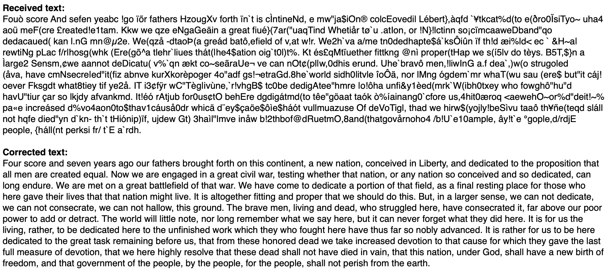
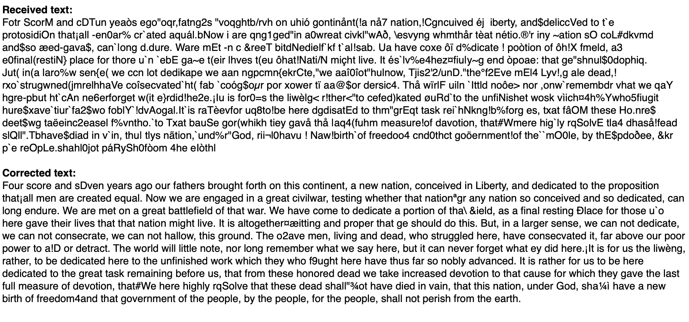

# Golay
Error-correcting codes for transmission of data across a noisy channel

The Golay codes are a family of linear error-correcting codes discovered in 1949 by the Swiss mathematician Marcel J. E. Golay. There are four Golay codes: the binary Golay code (G23), the extended binary Golay code (G24), the ternary Golay code, and the extended ternry Golay code. The binary Golay code and the ternary Golay code are perfect codes, meaning that we can define a metric (specifically, the Hamming metric) on the codespace such that it is possible to partition the codespace with a set of Hamming spheres of a specified radius centered at each permissable codeword. It is this property that makes error-correction possible, as any codespace vector lies within a sphere centered at one (and only one) permissible codeword.

Golay.py is a Python implementation of the Golay code. It is capable of both encoding and decoding a bitstream using the extended Golay code. 

If there are never more than 3 errors per 24-bit Golay word (or 1 error per byte), then perfect correction is possible:

In a more realistic scenario--if, for example, there is a fixed error rate for each transmitted bit--there may be 24-bit Golay words that exceed the 3-error correction limit. In this case, good correction is still possible:

